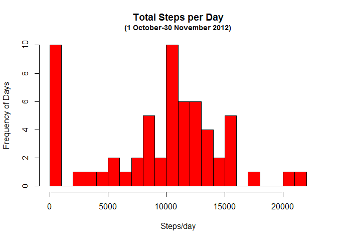
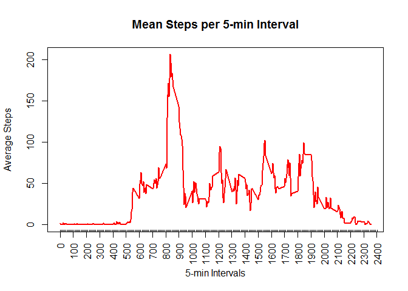
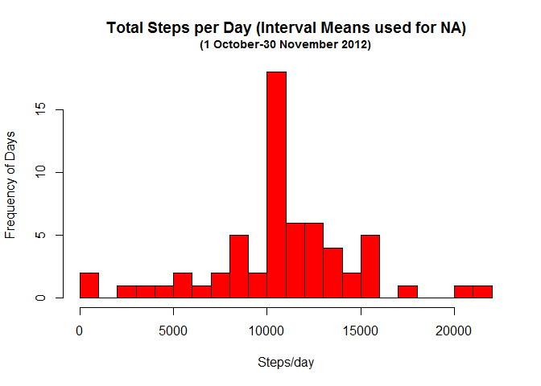
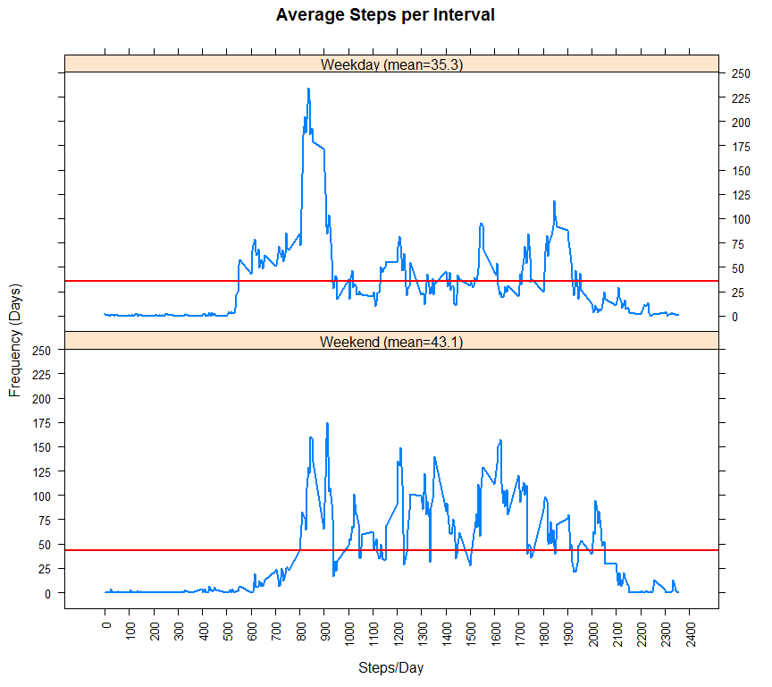

# Reproducible Research: Peer Assessment 1
D McMillan  


## Loading and preprocessing the data
The libraries required are specified below, and the data were read into an R data.table use this code:

```r
library(lattice)
library(data.table)
library(dplyr)

setwd("~/R/RepData")
ac0<-fread("activity.csv")
```
Following, a number of potentially useful additional variables were created, such as a weekday variable, and a weekend/weekday factor.

```r
ac0$hour=floor(ac0$interval/100)
ac0$wkday<-wday(ac0$date)
ac0$wkend<-ac0$wkday %in% c(1,7)
ac0$wkend.f<-factor(ac0$wkend,levels=c(TRUE,FALSE),c("Weekend","Weekday"))
```

## What is mean total number of steps taken per day?
The test period began 1 October 2012, ending on November 30 of the same year.
Summarizing the activity for each day, we obtain the histogram below:

```r
day_steps<- ac0 %>% group_by(date) %>% 
  summarize(tot_steps=sum(steps,na.rm=TRUE))
hist(day_steps$tot_steps,breaks=16,col='red',ann=FALSE)
title("Total Steps per Day",line=2)
title("(1 October-30 November 2012)",line=1,cex.main=.9)
title(ylab="Frequency of Days",xlab="Steps/day")
```

 

Also, the mean, and median are as follows:

```r
mean(day_steps$tot_steps,na.rm=TRUE)
```

```
## [1] 9354.23
```

```r
median(day_steps$tot_steps,na.rm=TRUE)
```

```
## [1] 10395
```

The excessive number of days showing zero or near-zero steps are suspicious, and could have an effect on the overall picture.  It appears that some days may be missing.  This mean, therefore, may be a low estimate.

## What is the average daily activity pattern?
Below is shown a time series plot of activity (measured by steps taken) as it occurs thoughout the day, on average.

```r
int_steps<- ac0 %>% group_by(interval) %>% summarize(avg_steps=mean(steps,na.rm=TRUE))

##plot of intervals
plot(int_steps$interval,int_steps$avg_steps,
     type='l',col='red',lwd=2,
     ylab='Average Steps',
     xlab='5-min Intervals',
     xaxt="n",
     main="Mean Steps per 5-min Interval")
axis(side=1,at=c(0:24)*100,labels=c(0:24)*100,las=2)
axis(side=1,at=c(0:240)*10+1/12,labels=FALSE,tck=.01)
```

 

It appears than the largest contributing times are between 8 and 9 am.
The largest single 5-minute interval begins at 8:35 am.

```r
maxSteps<-max(int_steps$avg_steps)
(int_steps[int_steps$avg_steps==maxSteps])
```

```
## Source: local data table [1 x 2]
## 
##   interval avg_steps
##      (int)     (dbl)
## 1      835  206.1698
```
## Imputing missing values

Next we fill in the missing values by using means from the corresponding interval on all other reporting days.

```r
mean_steps<- ac0 %>% group_by(interval) %>% mutate(avg_steps=mean(steps,na.rm=TRUE))
ac0$adjsteps<-ac0$steps
ac0$adjsteps[is.na(ac0$adjsteps)]<-mean_steps$avg_steps[is.na(mean_steps$steps)]
```

Resummarizing the data after imputing from the relevant means, we get a new mean and median.  Also, afteredrawing the histogram from above, we find that the number of zero-ish days has dropped off almost completely, confirm the suspicion that these were caused by missing data.

```r
day_steps<- ac0 %>% group_by(date) %>% summarize(tot_steps=sum(adjsteps,na.rm=TRUE))
hist(day_steps$tot_steps,breaks=16,col='red',ann=FALSE)
title("Total Steps per Day (Interval Means used for NA)",line=2)
title("(1 October-30 November 2012)",line=1,cex.main=.9)
title(ylab="Frequency of Days",xlab="Steps/day")
```

 

```r
mean(day_steps$tot_steps,na.rm=TRUE)
```

```
## [1] 10766.19
```

```r
median(day_steps$tot_steps,na.rm=TRUE)
```

```
## [1] 10766.19
```

Unsurprisingly, the mean has increased.  Little true information is provided by the median; since now all missing days have the mean value for total steps, it is not a shock that the median equals the mean.

## Are there differences in activity patterns between weekdays and weekends?
Finally, we take advantage of the weekend factor variable to show average activity patterns on weekdays compared to weekends.

```r
intw_steps<- ac0 %>% group_by(wkend.f,interval)  %>% summarize(avg_steps=mean(steps,na.rm=TRUE))
intw_steps<-arrange(intw_steps,intw_steps$wkend.f)
xm1<-round(mean(intw_steps$avg_steps[intw_steps$wkend.f=="Weekday"]),1)
xm2<-round(mean(intw_steps$avg_steps[intw_steps$wkend.f=="Weekend"]),1)
wdlabs=c(paste0("Weekend (mean=",xm2,")"),paste0("Weekday (mean=",xm1,")"))

xyplot(intw_steps$avg_steps~intw_steps$interval|intw_steps$wkend.f, 
       main="Average Steps per Interval",
       layout=c(1,2),
       ann=FALSE,
       strip=strip.custom(factor.levels=wdlabs),
       scales=list(y=list(at=c(0:12)*25), x=list(at=c(0:24)*100,rot=90)),
       panel=function(x, y,...){
         panel.xyplot(x,y,...) 
         panel.abline(h=mean(y),lwd=2,col='red') },
       ylab="Frequency (Days)", xlab="Steps/Day",type="l",lwd=2)
```

 

A few observations should be made.

1. Somewhat surprising is that fact that weekend activity surpasses weekday activity, on average.
2. Mornings in both cases get the most steps, and weekend or not, this happens between 8- and 9 am.
3. In accord with expectations of the "sleeping in" weekend opportunities, activity in the 5-8 am period is much reduced on the weekend.
4. Finally, overall activity on weekends seems more spread out across the daytime hours than it is on weekdays, when activity is high in the morning, and drops off a fair amount after 9am.

